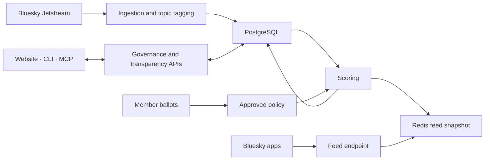

  

<h1 align="center">Corgi</h1>

  <strong>The feed your community controls.</strong> 
  A Bluesky feed with no black box. Members vote on how posts rank, and every score shows its math.

  <a href="https://bsky.app/profile/corgi-network.bsky.social/feed/community-gov"><strong>Open the feed</strong></a>
  ·
  <a href="https://feed.corgi.network/feed/"><strong>Explore the live ranking</strong></a>
  ·
  <a href="https://feed.corgi.network/demo/"><strong>Try the sandbox demo</strong></a>
  ·
  <a href="https://feed.corgi.network/how-it-works/"><strong>Watch the 4-minute overview</strong></a>

  
  
  

  Accepted to the <a href="https://recsys.acm.org/recsys26/demo-presentations/"><strong>ACM RecSys 2026</strong> Demos track</a> · Andrew Nordstrom, Anas Buhayh, Robin Burke · University of Colorado Boulder

Most feeds rank posts with rules nobody outside the company can see. Corgi is a custom Bluesky feed where the community sets those rules. Members vote on how much each ranking signal counts. After the result is reviewed, the whole feed reranks under the new policy, and anyone can open a post and see exactly why it landed where it did.

Bluesky shows the posts. Corgi shows why they're in that order.

## How it works

1. **Collect.** Corgi reads public Bluesky activity, applies the community's content rules, and tags each post's topics.
2. **Score.** Every post gets five signals, each from 0 to 1: recency, engagement, bridging, source diversity, and relevance to the community's topic priorities.
3. **Vote.** Pilot members vote in rounds on the signal weights, topic priorities, and content rules. Votes are aggregated, reviewed, and approved before they take effect.
4. **Rank and explain.** Each post's score is the sum of signal × weight. Corgi stores every part of that sum, so any ranking can be shown in full.

### A real receipt

This is the score breakdown for the post ranked #1 in Corgi Commons, captured from the live transparency API on 28 September 2026 (post identifiers omitted; full values in the [capture record](docs/lab/2026-09-28-readme-receipt-capture.md)):

| Signal | Raw score | × Community weight | = Contribution |
|---|---:|---:|---:|
| Recency | 0.9163 | 0.25 | 0.2291 |
| Engagement | 0.8736 | 0.20 | 0.1747 |
| Bridging | 0.9683 | 0.10 | 0.0968 |
| Source diversity | 1.0000 | 0.10 | 0.1000 |
| Relevance | 0.7500 | 0.35 | 0.2625 |
| **Total** | | | **0.8631** |

Ranked by engagement alone among the same 1,000 published posts, it would sit at **#41**. Under the community's policy it ranks **#1**.

## What's live and what's a preview

| | Status |
|---|---|
| **Corgi Commons feed** | Live. Anyone can view or subscribe in Bluesky. |
| **Score receipts** | Live. Every post shown in the public feed has a score breakdown. |
| **Sandbox demo** | Live. Change the policy and watch a fixed set of real posts rerank. No sign-in, and nothing you do touches the real feed. The other 24 voters are simulated. |
| **Community voting** | Limited pilot. Approved members vote in rounds, reviewed before they apply. No round is open right now. |
| **Scoring SDK** | Preview. The component contract and a worked example live in this repo; the package is not on npm yet. |
| **Self-hosting** | Early. Runs locally for development and evaluation; production self-hosting isn't supported yet. |
| **Communities beyond Corgi Commons** | Not yet. Corgi runs one community feed today. |

Nothing here reports results from a user study. The demo shows the mechanism; it is not evidence about how people vote.

## Build with Corgi

**The code is open.** Corgi is Apache-2.0. Fork it, run it, change it.

New ranking signals plug in through one interface. Implement `ScoringComponent`, register it, and it gets a votable weight and a place in every receipt. See the [component guide](docs/contributing-scoring-components.md), the [civility example](examples/civility-component/), and the [design record](docs/adr/ADR-0001-extensible-scoring-components.md).

Questions or ideas? [Open a GitHub issue](https://github.com/andrewnordstrom-eng/corgi/issues).

## Development status

Corgi is research software under active development. The code and scoring-component examples are open for inspection and contribution. Running it locally takes manual setup, including a Bluesky account for the feed identity; see [Development Setup](CONTRIBUTING.md#development-setup). Production self-hosting isn't supported yet.

## How it's built

PostgreSQL holds posts, policy, and every score breakdown. Redis serves the current ranked feed. The sandbox demo keeps its own state in a separate Redis instance and never changes the real feed.

| Path | What's there |
|---|---|
| [`src/ingestion/`](src/ingestion/) | Reading Bluesky activity, content rules, topic tagging |
| [`src/scoring/`](src/scoring/) | Signals, the scoring pipeline, stored breakdowns |
| [`src/governance/`](src/governance/) | Ballots, aggregation, review and approval |
| [`src/transparency/`](src/transparency/) | Public receipts, feed stats, audit views |
| [`src/demo/`](src/demo/) | The isolated sandbox demo |
| [`web-next/`](web-next/) | The website |
| [`packages/feed-sdk/`](packages/feed-sdk/) | The scoring-component contract |
| [`cli/`](cli/) | The operator CLI |

Deeper references: [system overview](docs/SYSTEM_OVERVIEW.md), [architecture](docs/ARCHITECTURE.md), [design records](docs/adr/), [operations runbook](docs/OPS_RUNBOOK.md), [API reference](https://docs.corgi.network/).

## Research

The name comes from the research project behind it: CORGI, Community-Oriented Recommendation: Governance and Infrastructure. The question it studies is collective rather than individual: can a community set the objective of a recommender it shares, and keep that process legible?

The paper, *CORGI: Communal Feed Governance for Bluesky*, was accepted to the [ACM RecSys 2026 Demos track](https://recsys.acm.org/recsys26/demo-presentations/). If you use Corgi in research, cite the paper and the exact commit you used. Keep claims about the software, the sandbox demo, and any future study results separate.

## Contributing, security, and license

- [Contributing](CONTRIBUTING.md): how to propose changes and new scoring components.
- [Security](SECURITY.md): report vulnerabilities privately, not in public issues.
- [Code of conduct](CODE_OF_CONDUCT.md).
- License: [Apache-2.0](LICENSE). The license covers the code, not the Corgi name or logo.
